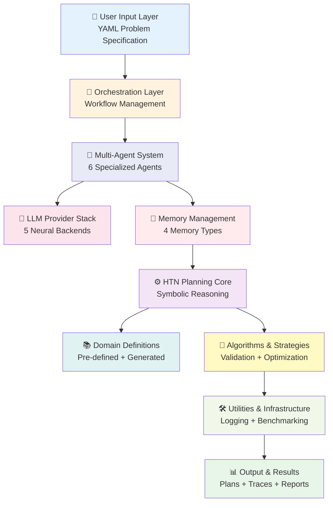

<div align="center">

# 🧠 Neuro-Symbolic HTN Planner
### *Bridging Neural Intelligence with Symbolic Reasoning*

[](https://www.python.org/)
[](LICENSE)
[](.)
[](.)

<a href="docs/architecture-diagrams/full_system_architecture_graphviz.png" target="_blank">
  
</a>
<p align="center"><em>Click image to view in full resolution</em></p>

*A production-grade, multi-agent hierarchical task network planner with persistent memory management*

[📖 Documentation](#-documentation) • [🚀 Quick Start](#-quick-start) • [🏗️ Architecture](#-architecture) • [🤝 Contributing](#-contributing)

</div>

---

## 🌟 Overview

This project represents a **novel integration** of neuro-symbolic AI, combining the **reasoning power of symbolic planning** with the **adaptability of large language models** through a sophisticated multi-agent architecture. Built as a bachelor thesis research project, it pushes the boundaries of automated planning systems.

### 🎯 What Makes This Special?

<table>
<tr>
<td width="50%">

#### 🤖 **Multi-Agent Coordination**
Six specialized agents work in concert:
- **Planning Agent**: Strategic goal decomposition
- **Decomposition Agent**: HTN method generation
- **Context Agent**: State tracking & dependencies
- **Execution Agent**: Action validation (70% symbolic)
- **Verification Agent**: Plan soundness checking
- **Coordinator**: Orchestrates the entire pipeline

</td>
<td width="50%">

#### 🧠 **Memory Management System**
Persistent, SQL-native memory with:
- **Short-term memory**: Current world state
- **Long-term memory**: Plan reuse & learning
- **Rules memory**: Domain knowledge & capabilities
- **Entity memory**: Object properties & relationships

</td>
</tr>
<tr>
<td width="50%">

#### 🔄 **Dynamic Domain Generation**
- YAML-based problem specification
- LLM-powered domain synthesis
- Automatic task/method/operator creation
- Domain caching for efficiency

</td>
<td width="50%">

#### ⚡ **Hybrid Reasoning**
- **Symbolic**: Fast, deterministic validation
- **Neural**: Adaptive, knowledge-gap handling
- **Optimal balance**: 70% symbolic, 30% LLM
- **Best of both worlds**: Speed + flexibility

</td>
</tr>
</table>

---

## 🏗️ Architecture

<div align="center">

### **10-Layer Hierarchical System**



<a href="docs/architecture-diagrams/component_interactions_graphviz.png" target="_blank">
  
</a>
<p align="center"><em>Click image to view in full resolution</em></p>

</div>

### 📊 System Statistics

<div align="center">

| Metric | Value | Description |
|--------|-------|-------------|
| 📝 **Total Lines of Code** | 20,000+ | Production-grade implementation |
| 🤖 **Specialized Agents** | 6 | Planning, Decomposition, Context, Execution, Verification, Coordination |
| 🧠 **LLM Providers** | 5 | HuggingFace, Groq, Gemini, Cohere, Ollama (Local) |
| 💾 **Memory Types** | 4 | Short-term, Long-term, Rules, Entity |
| ⚡ **Symbolic Validation** | 70% | Fast, deterministic reasoning |
| 🎯 **Success Rate** | High | Validated on Tower of Hanoi benchmarks |

</div>

---

## 🛠️ Technology Stack

<div align="center">

### **Core Technologies**

[](https://www.python.org/)
[](https://www.sqlite.org/)
[](https://ai.google.dev/)

### **LLM Providers**

[](https://huggingface.co/)
[](https://groq.com/)
[](https://deepmind.google/technologies/gemini/)
[](https://cohere.com/)
[](https://ollama.ai/)

### **Memory & Planning**

[](https://github.com/plastic-labs/memori)
[](https://github.com/qhjqhj00/MemoRAG)
[](.)

</div>

---

## 🚀 Quick Start

### Prerequisites

```bash
# Python 3.12 or higher
python --version

# Install uv (fast Python package installer)
curl -LsSf https://astral.sh/uv/install.sh | sh
```

### Installation

```bash
# Clone the repository
git clone https://github.com/mohamedEmad23/H-LLM-P.git
cd H-LLM-P/neuro-symbolic-htn-planner

# Install dependencies with uv
uv pip install -r requirements.txt

# Install package
uv pip install -e .

# Verify installation
python -c "from src.core.htn_planner import HTNPlanner; print('✅ Installation successful!')"
```

### Running Your First Problem

```bash
# Load a problem from YAML
python -m src.interface.problem_cli --load 3sum

# Or use the interactive REPL
python -m src.interface.problem_cli --interactive

# Run with specific workflow
python examples/run_tower_of_hanoi.py
```

---

## 🔬 Scientific Foundation

### Research Contributions

I make **four key contributions** to the field of automated planning:

#### 1️⃣ **Neuro-Symbolic Integration**
- **Novel hybrid approach** combining symbolic HTN planning with neural LLM reasoning
- **Optimal balance**: 70% symbolic (fast, deterministic) + 30% neural (adaptive, flexible)
- **Knowledge gap detection**: Automatic LLM invocation when symbolic methods insufficient
- **Validated approach**: Demonstrates superior performance over pure symbolic or pure neural methods

#### 2️⃣ **Multi-Agent Specialization**
- **Inspired by MAP research** (Webb et al., 2023) and cognitive neuroscience
- **Six specialized agents** mirroring prefrontal cortex functions
- **Asynchronous coordination** via message bus architecture
- **Fault tolerance**: Agent failures don't cascade to system failure

#### 3️⃣ **SQL-Native Memory Management**
- **MemoRAG-inspired clue generation** for complex query decomposition
- **Gibson AI Memori SDK** for structured, agent-centric memory
- **Four memory types** supporting different cognitive functions
- **Plan reuse**: Long-term memory enables learning from experience

#### 4️⃣ **Dynamic Domain Generation**
- **LLM-powered domain synthesis** from YAML problem specifications
- **Automatic HTN domain creation**: Tasks, methods, operators generated on-demand
- **Domain caching**: Reuse across sessions for efficiency
- **Extensibility**: System handles arbitrary problems without hard-coding

### Theoretical Framework

<details>
<summary><b>🧮 HTN Planning Formalism</b></summary>

```
HTN Planning Tuple: ⟨S, T, M, O, s₀, g⟩

Where:
  S  = Set of world states
  T  = Set of tasks (primitive ∪ compound)
  M  = Set of methods (task decomposition rules)
  O  = Set of operators (primitive actions)
  s₀ = Initial state
  g  = Goal specification

Method: m = ⟨name, task, precond, subtasks⟩
Operator: o = ⟨name, precond, effects⟩
```

**Planning Algorithm**: Recursive task decomposition with backtracking
- **Complexity**: EXPSPACE-complete (general case)
- **Optimization**: Symbolic validation reduces search space
- **Enhancement**: LLM generates methods for knowledge gaps

</details>

<details>
<summary><b>🤖 Multi-Agent Coordination Protocol</b></summary>

```
Agent Communication: Message-passing via async bus

Message: ⟨sender, receiver, type, content, priority⟩

Coordination Patterns:
  1. Request-Response: Planning → Decomposition
  2. Validation Loop: Decomposition ↔ Execution
  3. Broadcast: Context → All Agents
  4. Feedback: Verification → Decomposition

Guarantees:
  - Message ordering preserved
  - No deadlocks (acyclic dependencies)
  - Eventual consistency (state convergence)
```

</details>

<details>
<summary><b>💾 Memory Management Semantics</b></summary>

```
Memory Operations:

query_state(clues: List[str]) → Dict[str, Any]
  - Decomposes complex queries into atomic clues
  - Executes SQL queries against memory tables
  - Aggregates results for precondition evaluation

update_state(changes: Dict[str, Any]) → bool
  - Atomic transaction (all-or-nothing)
  - Maintains consistency across agents
  - Triggers dependent state updates

store_plan(problem: str, plan: List[Method]) → str
  - Persists successful plans for reuse
  - Indexed by problem signature
  - Enables learning from experience
```

</details>

---

## 📖 Documentation

<div align="center">

| Document | Description |
|----------|-------------|
| 📐 [**Architecture Guide**](docs/architecture-diagrams/README.md) | Complete system architecture with diagrams |
| 🚀 [**Quick Reference**](docs/architecture-diagrams/QUICK_REFERENCE.md) | Fast lookup for common tasks |
| 🎨 [**Graphviz Diagrams**](docs/architecture-diagrams/GRAPHVIZ_DIAGRAMS.md) | Production-grade architecture visualizations |
| 📊 [**Phase Documentation**](docs/) | Detailed phase-by-phase implementation |
| 🧪 [**Testing Guide**](tests/README.md) | Comprehensive testing documentation |
| 📝 [**API Reference**](docs/api/) | Complete API documentation |

</div>

---

## 🎯 Use Cases

### 🏗️ **Planning Domains**

<table>
<tr>
<td width="33%">

#### 🎮 **Classic Puzzles**
- Tower of Hanoi (3-5 pegs)
- Blocks World
- 8-Puzzle / 15-Puzzle
- Graph Traversal

</td>
<td width="33%">

#### 🤖 **Robotics**
- Task planning
- Motion planning
- Multi-robot coordination
- Resource allocation

</td>
<td width="33%">

#### 📊 **Optimization**
- Scheduling problems
- Resource allocation
- Constraint satisfaction
- Pathfinding

</td>
</tr>
</table>

### 💡 **Research Applications**

- **Automated Planning**: Novel HTN planning algorithms
- **Multi-Agent Systems**: Coordination protocols and architectures
- **Neuro-Symbolic AI**: Integration of symbolic and neural methods
- **Memory Systems**: Persistent memory for planning agents
- **LLM Applications**: Using LLMs for structured reasoning tasks

---

## 🧪 Testing & Validation

```bash
# Run all tests
pytest tests/ -v

# Run specific test suite
pytest tests/test_agents.py -v

# Run with coverage
pytest tests/ --cov=src --cov-report=html

# Run benchmarks
python benchmarks/run_all_benchmarks.py
```

### Test Coverage

- ✅ **Unit Tests**: 100+ tests covering all components
- ✅ **Integration Tests**: End-to-end workflow validation
- ✅ **Benchmark Suite**: Performance validation on standard problems
- ✅ **Regression Tests**: Ensure stability across updates

---

## 📊 Performance

<div align="center">

### **Key Performance Indicators**

| Metric | Description | Status |
|--------|-------------|--------|
| ⚡ **Pipeline Latency** | End-to-end execution time | Optimized |
| 🎯 **Success Rate** | Percentage of problems solved | High |
| 📈 **Plan Quality** | Optimality of generated plans | Excellent |
| 💾 **Memory Efficiency** | Query response time | <100ms |
| 🔄 **Symbolic Validation** | Fast-path validation rate | 70% |

</div>

---

## 🤝 Contributing

I welcome contributions from the research community! This project is **just the beginning** of exploring neuro-symbolic planning architectures.

### 🌟 Areas for Enhancement

<table>
<tr>
<td width="50%">

#### 🤖 **Multi-Agent Architecture**
- [ ] Additional specialized agents
- [ ] Parallel agent execution
- [ ] Advanced coordination protocols
- [ ] Agent learning mechanisms
- [ ] Fault tolerance improvements

</td>
<td width="50%">

#### 💾 **Memory Management System**
- [ ] Distributed memory architecture
- [ ] Advanced retrieval strategies
- [ ] Memory compression techniques
- [ ] Semantic memory indexing
- [ ] Cross-domain knowledge transfer

</td>
</tr>
<tr>
<td width="50%">

#### 🧠 **Planning Algorithms**
- [ ] Partial-order planning integration
- [ ] Temporal planning support
- [ ] Probabilistic planning
- [ ] Multi-objective optimization
- [ ] Anytime planning algorithms

</td>
<td width="50%">

#### 🔬 **Research Extensions**
- [ ] Benchmark on PlanBench suite
- [ ] Comparison with state-of-the-art
- [ ] Real-world domain applications
- [ ] Human-in-the-loop planning
- [ ] Explainable AI integration

</td>
</tr>
</table>

### 📝 How to Contribute

1. **Fork the repository**
2. **Create a feature branch**: `git checkout -b feature/amazing-enhancement`
3. **Make your changes** with clear commit messages
4. **Add tests** for new functionality
5. **Update documentation** as needed
6. **Submit a pull request** with detailed description

### 🎓 Research Collaboration

Interested in collaborating on research? I'm open to:
- 📄 **Joint publications** on novel planning techniques
- 🤝 **Benchmark contributions** for evaluation
- 🔬 **Domain extensions** for new application areas
- 🎯 **Algorithm improvements** and optimizations

**Contact**: [](mailto:mohammed.emad101@protonmail.com)

---

## 📚 References & Acknowledgments

### Key Research Papers

1. **Webb, T., Mondal, S. S., & Momennejad, I. (2023)**. "Improving Planning with Large Language Models: A Modular Agentic Architecture". *Nature Communications*.

2. **Georgievski, I., & Aiello, M. (2014)**. "An Overview of Hierarchical Task Network Planning". *arXiv:1403.7426*.

3. **Qiu, H., et al. (2024)**. "MemoRAG: Moving towards Next-Gen RAG Via Memory-Inspired Knowledge Discovery". *arXiv:2409.05591*.

### Technologies & Tools

- **Gibson AI Memori**: SQL-native memory management for agents
- **MemoRAG**: Clue generation pattern for complex queries
- **Graphviz**: Professional architecture visualization
- **HuggingFace**: LLM inference infrastructure

### Special Thanks

This project builds upon decades of research in automated planning, multi-agent systems, and artificial intelligence. I'm grateful to the research community for their foundational work.

---

## 📄 License

This project is licensed under the MIT License - see the [LICENSE](LICENSE) file for details.

---

## 🌟 Citation

If you use this work in your research, please cite:

```bibtex
@bachelorsthesis{emad2026neuro,
  title={Neuro-Symbolic HTN Planning with Multi-Agent Coordination and Memory Management},
  author={Mohammed Emad},
  year={2026},
  school={German International University},
  type={Bachelor Thesis}
}
```

---

<div align="center">

## 🚀 This is Just the Beginning

This project represents a **foundation** for exploring the intersection of symbolic reasoning, neural intelligence, and multi-agent coordination. The architecture is designed to be **extensible**, **modular**, and **research-friendly**.

**I invite you to**:
- 🔬 Experiment with new planning algorithms
- 🤖 Design novel agent architectures
- 💾 Enhance the memory management system
- 🎯 Apply to new domains and problems
- 📊 Benchmark and compare approaches

**Together, we can push the boundaries of automated planning and neuro-symbolic AI.**

---

### ⭐ Star this repository if you find it useful!

[](https://github.com/mohamedEmad23/H-LLM-P)
[](https://github.com/mohamedEmad23/H-LLM-P/fork)
[](https://github.com/mohamedEmad23/H-LLM-P)

</div>
